# Gadget Seva Hub — Admin Portal User Guide

> **Role:** ADMIN  
> **Access:** Full access to all modules — service requests, pickup, hub, repair, billing, users, reports, documents, notifications, settings, and audit.  
> **Login URL:** https://front-end-uat.up.railway.app/login

---

## Table of Contents

1. [How to Log In](#1-how-to-log-in)
2. [Dashboard — Your Home Screen](#2-dashboard--your-home-screen)
3. [Creating a Service Request](#3-creating-a-service-request)
4. [Managing All Requests](#4-managing-all-requests)
5. [Pickup Management](#5-pickup-management)
   - [Pickup Dashboard](#51-pickup-dashboard)
   - [Runner Onboarding](#52-runner-onboarding)
   - [Assign Pickup](#53-assign-pickup)
   - [Pending Pickup](#54-pending-pickup)
6. [User Management](#6-user-management)
7. [Billing & Invoicing](#7-billing--invoicing)
8. [Document Library](#8-document-library)
9. [Reports](#9-reports)
10. [Notifications](#10-notifications)
11. [Settings](#11-settings)
12. [Audit Logs](#12-audit-logs)
13. [Logging Out](#13-logging-out)

---

## 1. How to Log In

Open the portal URL in your browser. You will see the **Sign in to Ops Console** screen.

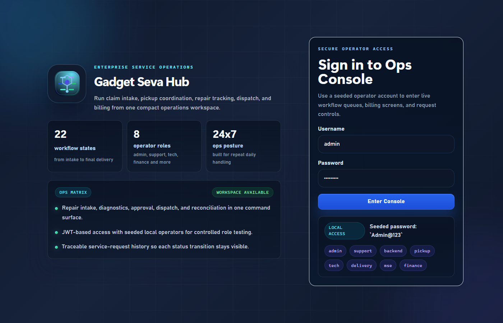

**Steps:**

| Step | Action |
|---|---|
| 1 | Open the browser and go to the portal URL |
| 2 | Enter your **Username** (e.g. `admin`) |
| 3 | Enter your **Password** (e.g. `Admin@123`) |
| 4 | Click the **Enter Console** button |

> The login page shows a "LOCAL ACCESS" tile at the bottom with all available seeded usernames and the default password `Admin@123` for reference.

After successful login you will be taken to the **Dashboard**.

---

## 2. Dashboard — Your Home Screen

After logging in you land on the **Dashboard**. This is your operational overview screen.

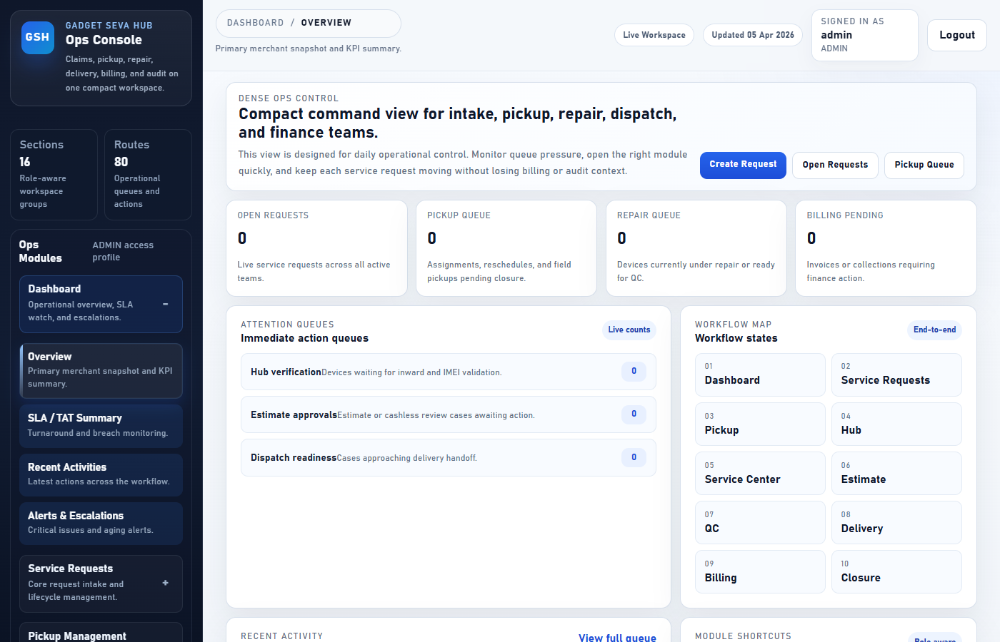

**What you can see here:**

| Section | Purpose |
|---|---|
| KPI Cards (top row) | Total requests, open, in-progress, completed counts at a glance |
| SLA Status | How many requests are within SLA vs breached |
| Recent Activity | Latest status changes across all claims |
| Left Sidebar | Full navigation menu — expand any section to go to that module |

**Navigation tip:** Click any section in the left sidebar to expand it, then click a sub-item to go to that page.

---

## 3. Creating a Service Request

This is how you register a new customer claim in the system.

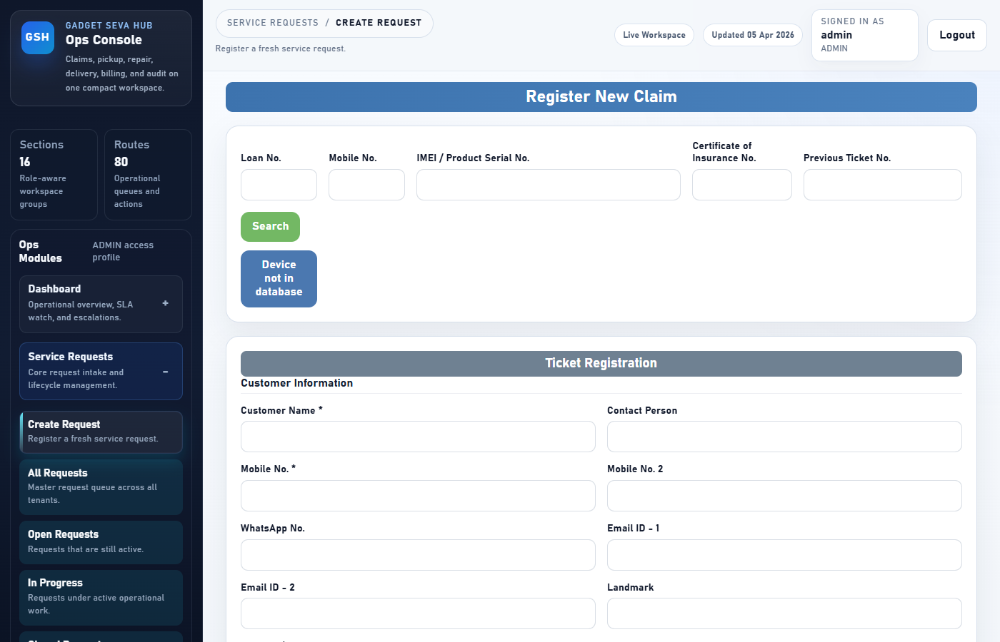

**Steps to create a new request:**

| Step | Field | What to Enter |
|---|---|---|
| 1 | **Customer Name** | Full name of the customer or company |
| 2 | **Phone** | Primary contact number |
| 3 | **Address** | Pickup address — Line 1, City, State, Postal Code |
| 4 | **Device Brand / Model** | e.g. Samsung, Galaxy S21 |
| 5 | **Device Category** | Select from dropdown (Mobile, Laptop, etc.) |
| 6 | **Serial Number** | Device serial or IMEI number |
| 7 | **Issue Summary** | Brief one-line description of the problem |
| 8 | **Priority** | Select LOW / MEDIUM / HIGH / CRITICAL |
| 9 | **Source Channel** | How the request came in (Walk-in, WhatsApp, Email, etc.) |
| 10 | Click **Submit** | Request is created and assigned a ticket number |

> After submission, the request appears in the **All Requests** queue with status `REGISTERED`.

---

## 4. Managing All Requests

This screen shows every claim across all statuses.

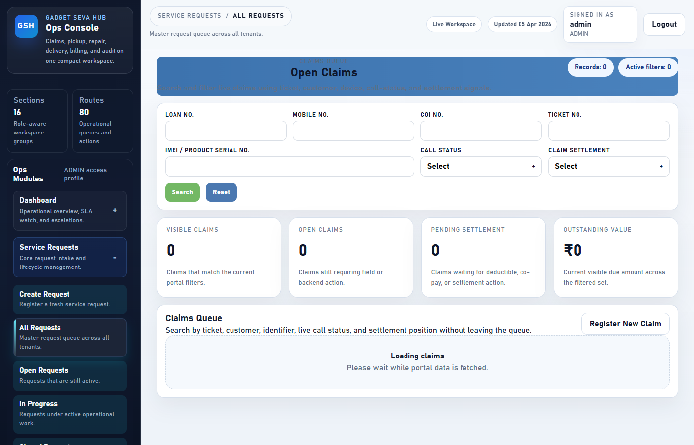

**How to use this screen:**

| Action | How |
|---|---|
| Search a claim | Use the search box at the top — search by ticket number, customer name, or device |
| Filter by status | Use the status filter dropdown to narrow down the list |
| Open a claim | Click any request card to open the full details page |
| View timeline | Inside a request, scroll to the **Timeline** tab to see all status changes |
| Upload documents | Inside a request, use the **Attachments** tab to add photos or files |

**Request status flow:**

```
REGISTERED → PICKUP_ASSIGNED → PICKUP_ACCEPTED → PICKED_UP
→ RECEIVED_AT_HUB → DIAGNOSIS_IN_PROGRESS → ESTIMATE_SUBMITTED
→ ESTIMATE_APPROVED → REPAIR_IN_PROGRESS → REPAIR_COMPLETED
→ QC_PASSED → READY_FOR_DISPATCH → OUT_FOR_DELIVERY → DELIVERED
→ INVOICED → CLOSED
```

---

## 5. Pickup Management

### 5.1 Pickup Dashboard

Overview of all pickup activity in one place.

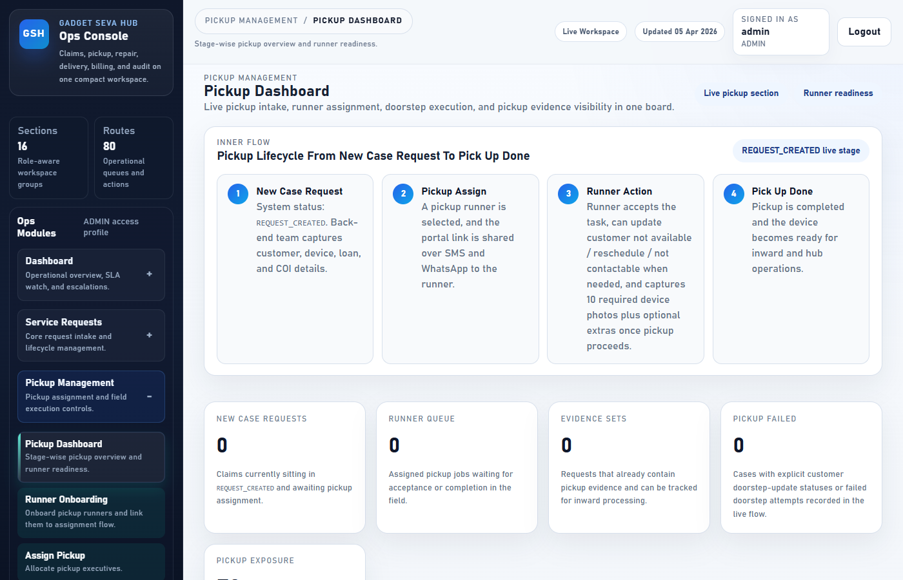

Shows counts of:
- Pickups pending assignment
- Pickups accepted by runners
- Pickups in progress
- Pickups completed today

---

### 5.2 Runner Onboarding

Add new pickup runners to the system before assigning pickups.

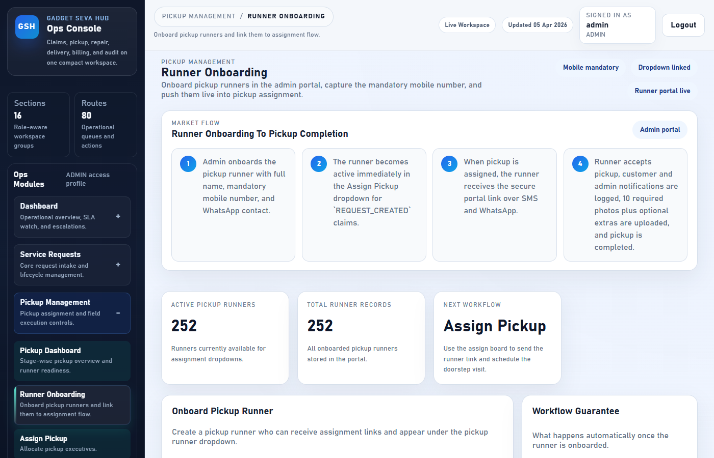

**Steps to onboard a new runner:**

| Step | Field | Detail |
|---|---|---|
| 1 | **Full Name** | Runner's legal full name |
| 2 | **Phone** | Mobile number (used for WhatsApp link delivery) |
| 3 | **WhatsApp Number** | If different from phone |
| 4 | **Email** | Optional contact email |
| 5 | **Username** | Login username for the runner app |
| 6 | Click **Save Runner** | Runner account is created |

> After onboarding, the runner can log in at `/runner-app` using their username and the default password.

---

### 5.3 Assign Pickup

Assign a pickup runner to a request that has been registered.

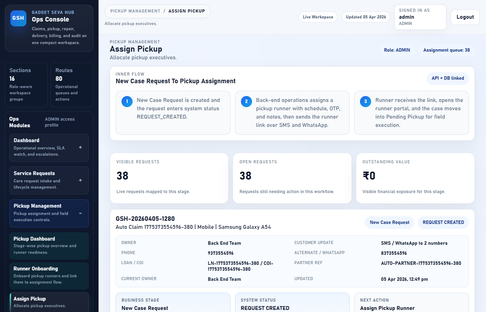

**Steps to assign a pickup:**

| Step | Action |
|---|---|
| 1 | Find the request in the list (use search or scroll) |
| 2 | Click **Assign Pickup** on the request card |
| 3 | Select the **Runner** from the dropdown |
| 4 | Set the **Scheduled Date & Time** for pickup |
| 5 | Add any **Notes** for the runner (optional) |
| 6 | Click **Save Assignment** |

> The runner receives a WhatsApp link with the pickup portal URL. The OTP is auto-generated for identity verification.

---

### 5.4 Pending Pickup

View all pickups that have been assigned but not yet completed.

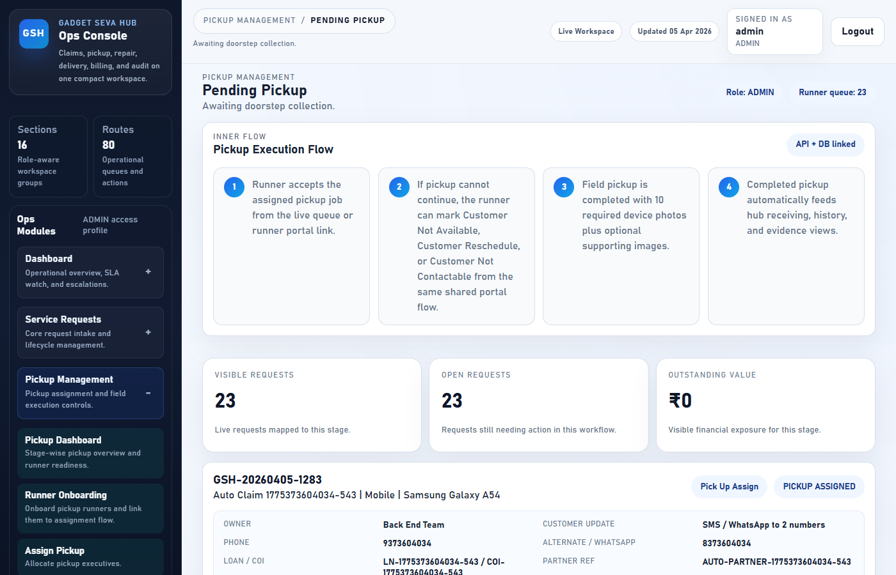

| Column | Meaning |
|---|---|
| Request # | Ticket number for the claim |
| Customer | Customer name and address |
| Runner | Assigned pickup runner name |
| Scheduled At | Date and time of the pickup |
| Status | Current status (ASSIGNED / ACCEPTED / IN_PROGRESS) |

---

## 6. User Management

Manage all portal users — admins, support staff, technicians, delivery agents, and customers.

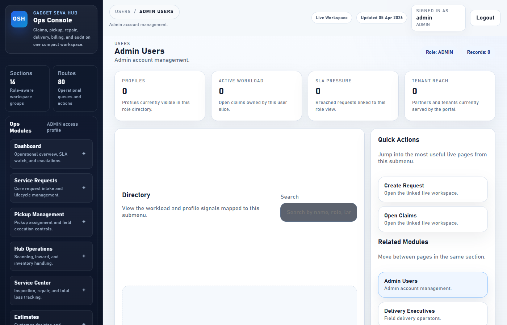

**Sub-sections available:**

| Menu Item | Purpose |
|---|---|
| Admin Users | Create and manage admin accounts |
| Delivery Executives | Manage delivery agent accounts |
| Hub Operators | Manage hub inward staff |
| Service Center Users | Manage technician accounts |
| Customers | View customer directory and profiles |
| Roles & Permissions | View the access control matrix per role |

**To create a new user:**
1. Click the relevant user type in the left menu
2. Click **Add User** or **Onboard**
3. Fill in the Name, Phone, Username, and Role fields
4. Click **Save** — the account is created immediately

---

## 7. Billing & Invoicing

Generate GST-compliant invoices and track payments.

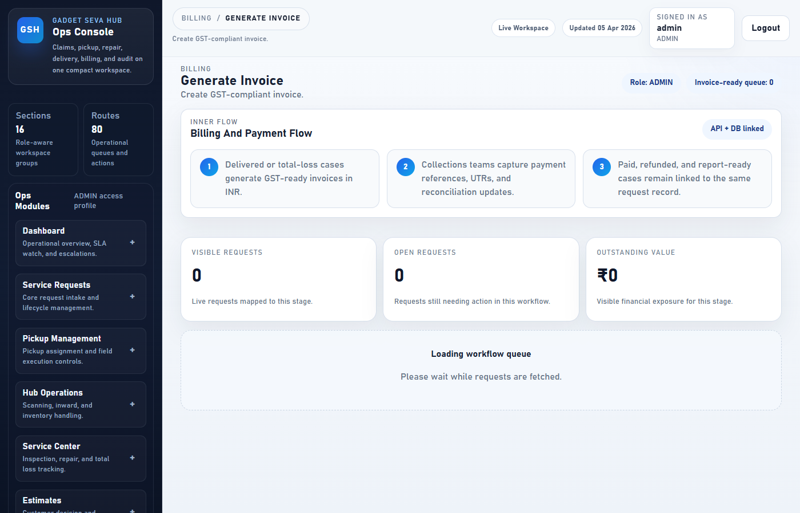

**Billing workflow:**

| Step | Action |
|---|---|
| 1 | Open the request that has been delivered and repair is complete |
| 2 | Go to **Billing → Generate Invoice** |
| 3 | Select the request from the list |
| 4 | Fill in GST details (State Code, Place of Supply, GST Rate) |
| 5 | Add Labour and Parts descriptions |
| 6 | Click **Generate Invoice** |
| 7 | Invoice PDF is generated and linked to the request |

**Payment Reconciliation:**
- Go to **Billing → Payment Reconciliation**
- Find the payment by UTR or reference number
- Mark as `RECONCILED` or `MISMATCHED`
- Save remarks

---

## 8. Document Library

Upload and share SOPs, policies, training materials, and reports with the team.

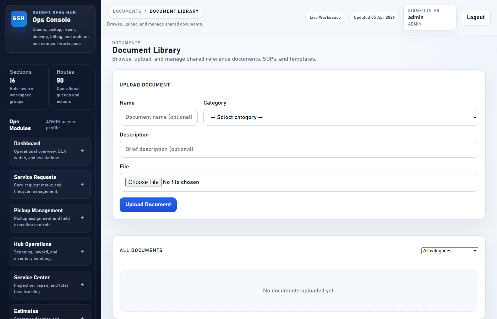

**How to upload a document:**

| Step | Field | Detail |
|---|---|---|
| 1 | **Name** | Document title (e.g. "Pickup SOP v2") |
| 2 | **Category** | Select SOP / Policy / Training / Template / Report / Other |
| 3 | **Description** | Brief one-line description |
| 4 | **File** | Click to choose a file (PDF, image, Word, etc.) |
| 5 | Click **Upload Document** | File is stored and a secure link is generated |

**How to view or download a document:**
- Click **View** to open PDFs and images directly in a new browser tab
- Click **Download** to save the file to your computer

**How to delete a document (Admin only):**
- Click **Delete** on any document card
- Confirm the prompt — the file is permanently removed

> The category filter at the top lets you narrow the list to one category at a time.

---

## 9. Reports

View operational reports across all workflow stages.

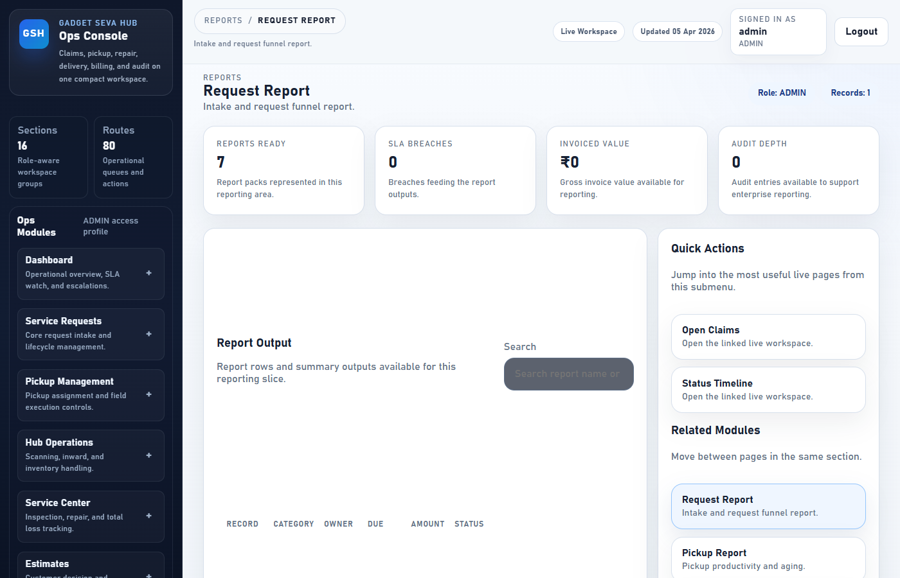

**Available reports:**

| Report | What It Shows |
|---|---|
| Request Report | Intake volume, open vs closed counts by period |
| Pickup Report | Pickup completion rates and runner performance |
| Repair Report | Repair throughput and total loss rates |
| Delivery Report | Dispatch and completion metrics |
| SLA / TAT Report | Breach counts and average turnaround time |
| Revenue Report | Collections, outstanding amounts, refunds |
| Audit Logs | Full enterprise change log |

---

## 10. Notifications

Monitor SMS and email delivery to customers.

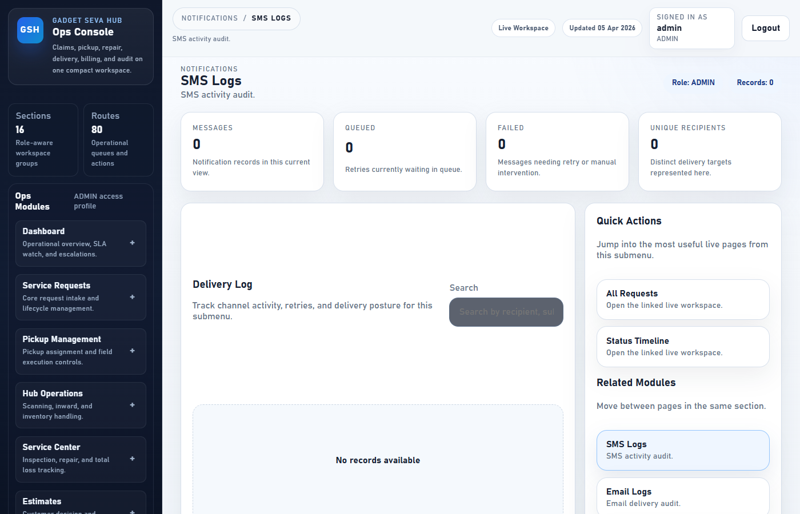

**Sub-sections:**

| Section | Purpose |
|---|---|
| SMS Logs | All outbound SMS messages with delivery status |
| Email Logs | All outbound emails with delivery status |
| Failed Notifications | Messages that failed — can be retried |
| Templates | View and manage notification message templates |

**If a notification failed:**
1. Go to **Notifications → Failed Notifications**
2. Find the failed message
3. Check the error reason
4. Click **Retry** to resend

---

## 11. Settings

Configure system-wide behaviour.

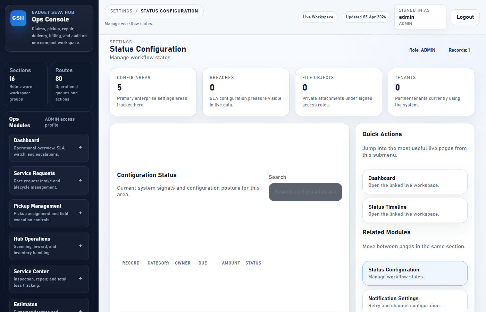

**Available settings:**

| Section | Purpose |
|---|---|
| Status Configuration | Manage workflow states and allowed transitions |
| Notification Settings | Configure retry intervals and channel priority |
| SLA Configuration | Set SLA hours per tenant and priority level |
| File Storage Config | Configure storage paths and signed URL TTL |
| System Preferences | Global platform preferences |

> Changes to status configuration affect the entire workflow. Make changes carefully and only during non-peak hours.

---

## 12. Audit Logs

Full traceability of every action taken in the system.

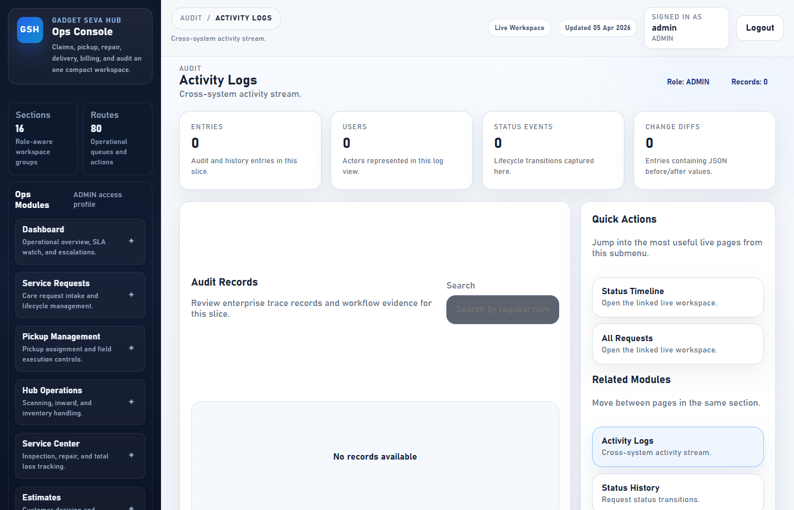

**Sub-sections:**

| Section | What It Tracks |
|---|---|
| Activity Logs | All actions across every module (create, update, delete) |
| Status History | Every status transition for every request |
| User Actions | Actions performed by each individual user |
| Change Logs | Before and after values for every field change |

**Use audit logs to:**
- Investigate a complaint or dispute
- Verify who made a specific change
- Confirm when a status was changed and by whom

---

## 13. Logging Out

To log out of the admin portal:

1. Click your **username or avatar** in the top-right corner of the screen
2. Click **Sign Out** or **Logout**
3. You will be redirected to the login page

> For security, always log out when leaving your workstation.

---

## Quick Reference

| Task | Where to Go |
|---|---|
| Create a new claim | Service Requests → Create Request |
| Find a specific ticket | Service Requests → Search Request |
| Assign a pickup | Pickup Management → Assign Pickup |
| Add a new runner | Pickup Management → Runner Onboarding |
| Generate an invoice | Billing → Generate Invoice |
| Reconcile a payment | Billing → Payment Reconciliation |
| Add a new staff member | Users → (select role) |
| Upload an SOP or policy | Documents → Document Library |
| Check SLA breaches | Dashboard → SLA / TAT Summary |
| View audit trail | Audit → Activity Logs |
| Retry a failed SMS | Notifications → Failed Notifications |

---

*Document version: April 2026 | Gadget Seva Hub Ops Console*
