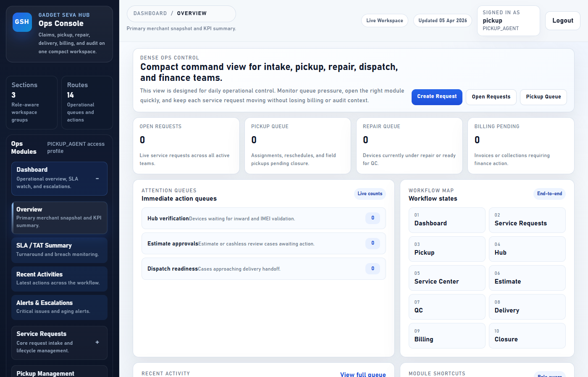
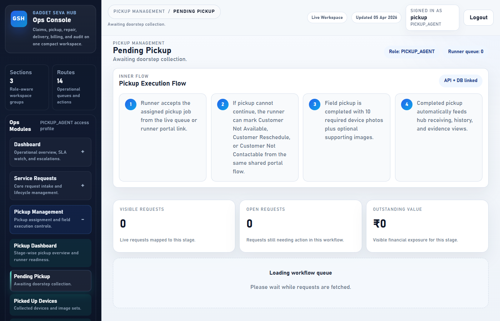
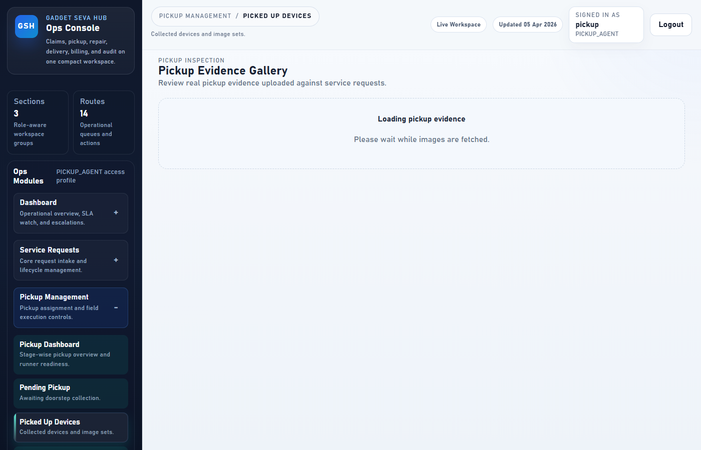
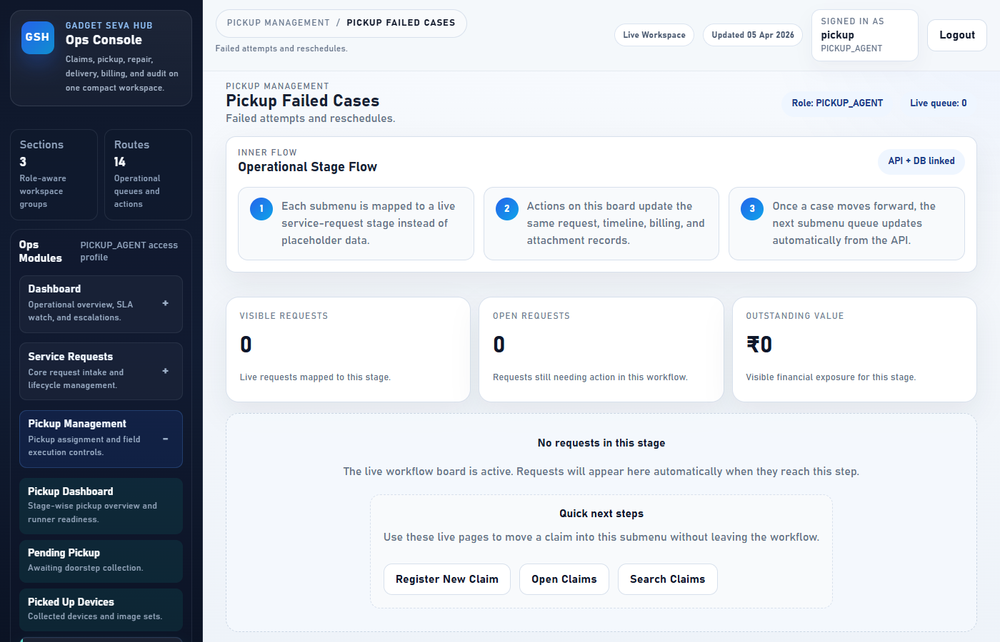
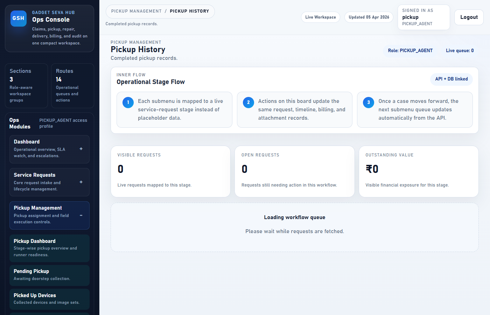
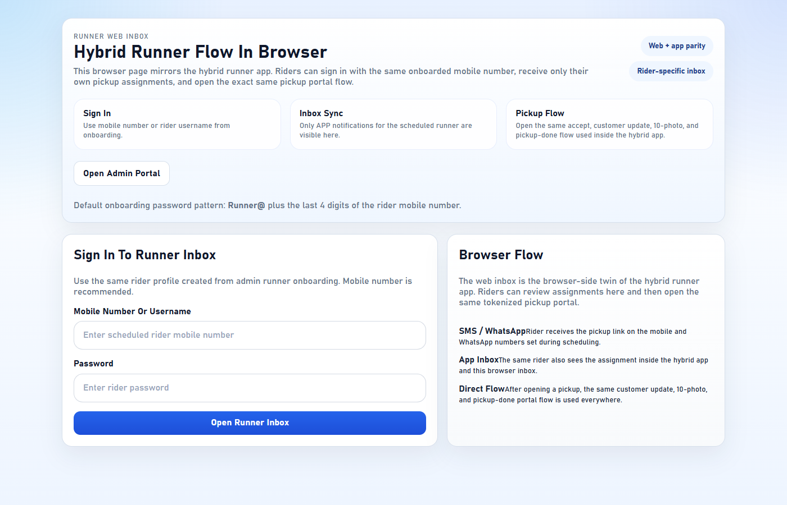

# Gadget Seva Hub — Pickup Runner Portal Guide

> **Role:** PICKUP_AGENT  
> **Access:** Pickup management workspace + dedicated Runner App for field operations  
> **Login URL:** https://front-end-uat.up.railway.app/login  
> **Runner App URL:** https://front-end-uat.up.railway.app/runner-app

---

## Table of Contents

1. [How to Log In](#1-how-to-log-in)
2. [Your Dashboard After Login](#2-your-dashboard-after-login)
3. [Pending Pickup — Your Active Assignments](#3-pending-pickup--your-active-assignments)
4. [Picked Up Devices — What You Have Collected](#4-picked-up-devices--what-you-have-collected)
5. [Pickup Failed Cases — Failed Attempts](#5-pickup-failed-cases--failed-attempts)
6. [Pickup History — Completed Pickups](#6-pickup-history--completed-pickups)
7. [Runner App — Field Pickup Flow](#7-runner-app--field-pickup-flow)
   - [Step 1 — Log in to the Runner App](#step-1--log-in-to-the-runner-app)
   - [Step 2 — Accept a Pickup Assignment](#step-2--accept-a-pickup-assignment)
   - [Step 3 — Upload 10 Mandatory Device Photos](#step-3--upload-10-mandatory-device-photos)
   - [Step 4 — Complete the Pickup](#step-4--complete-the-pickup)
8. [Using the Pickup Portal Link (WhatsApp)](#8-using-the-pickup-portal-link-whatsapp)
9. [What to Do If Pickup Fails](#9-what-to-do-if-pickup-fails)
10. [Quick Reference](#10-quick-reference)

---

## 1. How to Log In

Open the portal in your browser and enter your credentials.

**Steps:**

| Step | Action |
|---|---|
| 1 | Open the browser and go to the portal URL |
| 2 | Enter your **Username** (given to you by Admin — e.g. `pickup`) |
| 3 | Enter your **Password** (default: `Admin@123`) |
| 4 | Click **Enter Console** |

> If you cannot log in, contact your Admin to verify your account is active.

---

## 2. Your Dashboard After Login

After logging in you see the **Dashboard**. As a Pickup Runner you will mainly use the **Pickup Management** section in the left sidebar.

**Your main navigation sections:**

| Left Menu Section | What You Use It For |
|---|---|
| Dashboard | Overview and KPI summary |
| Service Requests | View all requests relevant to your role |
| Pickup Management | Your active daily workflow — see all sub-sections below |

> You will only see sections that are relevant to your PICKUP_AGENT role. Billing, Settings, and Admin screens are not accessible to you.

---

## 3. Pending Pickup — Your Active Assignments

This is where you see every pickup that has been assigned to you but not yet completed.

**Each assignment card shows:**

| Field | Meaning |
|---|---|
| Request Number | Ticket reference (e.g. `GSH-2026-0001`) |
| Customer Name | Name of the customer you are collecting from |
| Address | Pickup location |
| Scheduled Time | When you are expected to reach the customer |
| Runner | Confirms the assignment is for you |
| Status | Current status: `PICKUP_ASSIGNED` or `PICKUP_ACCEPTED` |
| OTP | The 4-digit verification code (show to customer before collecting the device) |

**What to do from this screen:**
1. Note the customer address and scheduled time
2. Use the **Runner App** (see Section 7) to accept and execute the pickup on-site
3. After completion the request moves to **Picked Up Devices**

---

## 4. Picked Up Devices — What You Have Collected

Shows all devices you have already collected and photographed.

**What you can see:**

| Field | Meaning |
|---|---|
| Request Number | Ticket reference |
| Customer Name | Customer name |
| Device | Device brand and model |
| Picked Up At | Date and time you completed the pickup |
| Photos Uploaded | Count of mandatory + optional photos submitted |
| Status | `PICKED_UP` |

> Once a device shows here, the hub team takes over. No further action is needed from you unless the hub requests re-verification.

---

## 5. Pickup Failed Cases — Failed Attempts

If a pickup attempt fails (customer not available, refused, wrong address, etc.) the request appears here.

**Common reasons for failure:**

| Reason | What to Do |
|---|---|
| Customer not home | Contact Admin — they will reschedule |
| Customer refused pickup | Contact Admin — request needs escalation |
| Wrong address | Contact Admin with the correct address details |
| Device not ready | Contact Admin — Admin will update the schedule |

> You do not reschedule directly. Report the failure through the Runner App and contact your Admin.

---

## 6. Pickup History — Completed Pickups

Your full record of every pickup you have successfully completed.

**Use this screen to:**
- Verify a pickup was recorded correctly
- Check the date and time of a past collection
- Look up which photos were uploaded for a specific device

---

## 7. Runner App — Field Pickup Flow

The **Runner App** is your main tool when you are at the customer's location. It works on both mobile and desktop browsers.

### Step 1 — Log in to the Runner App

Go to: `https://front-end-uat.up.railway.app/runner-app`

Enter your **username** and **password** to log in. You will see a list of your assigned pickups.

---

### Step 2 — Accept a Pickup Assignment

When you arrive at the customer's location:

1. Open the Runner App on your phone
2. Find the correct assignment in your list
3. Tap **Accept Pickup**
4. The status changes to `PICKUP_ACCEPTED` — the hub and admin can now see you are on-site

> **Verify the OTP with the customer** before collecting the device. Ask the customer for the 4-digit OTP they received via SMS or WhatsApp. Match it with the OTP shown in your portal.

---

### Step 3 — Upload 10 Mandatory Device Photos

You must upload **all 10 mandatory photos** before you can complete the pickup. These photos are required for cashless evidence and quality records.

| # | Photo Type | What to Capture |
|---|---|---|
| 1 | **Front** | Screen facing forward, full device visible |
| 2 | **Back** | Back panel, full device visible |
| 3 | **Left side** | Left edge of the device |
| 4 | **Right side** | Right edge of the device |
| 5 | **Top** | Top edge (power button, headphone jack area) |
| 6 | **Bottom** | Bottom edge (charging port area) |
| 7 | **Display On** | Screen powered on showing the home screen |
| 8 | **Serial Label** | IMEI sticker or serial number label (inside back cover or box) |
| 9 | **Damage Closeup** | Any existing visible damage zoomed in |
| 10 | **Accessories** | All accessories handed over (charger, case, cables) |

**How to upload:**
1. In the pickup portal page, scroll to the **Photos** section
2. Tap the upload button for each photo type
3. Choose a photo from your phone gallery or take a new one with the camera
4. Confirm the upload — a green tick appears when done
5. Repeat for all 10 photo types

> Do not skip any photo. The system will not allow you to mark the pickup as complete if photos are missing.

---

### Step 4 — Complete the Pickup

Once all 10 photos are uploaded:

1. Scroll to the bottom of the pickup portal page
2. Tap **Complete Pickup**
3. Confirm the action
4. The status changes to `PICKED_UP`
5. The device appears in your **Picked Up Devices** tab

**You are done.** Hand over any required acknowledgement slip to the customer if your admin has provided one.

---

## 8. Using the Pickup Portal Link (WhatsApp)

When the admin assigns a pickup to you, you receive a **WhatsApp message** with a unique pickup portal link.

**How to use it:**

| Step | Action |
|---|---|
| 1 | Open the WhatsApp message from Gadget Seva Hub |
| 2 | Tap the link — it opens the pickup portal directly in your phone's browser |
| 3 | No login required — the link is pre-authenticated for you |
| 4 | Follow Steps 2–4 above (accept, upload photos, complete) |

> The link is valid for your assigned pickup only. Do not share the link with others.

---

## 9. What to Do If Pickup Fails

If you reach the customer but cannot collect the device:

| Situation | Action |
|---|---|
| Customer not available | Mark status as `PICKUP_FAILED` in the portal, add reason in the Notes field |
| Customer refused | Mark as `PICKUP_FAILED`, note "Customer refused", contact Admin |
| Device not in condition to pick up | Mark as `PICKUP_FAILED`, note the condition issue |
| Address not found | Mark as `PICKUP_FAILED`, note "Wrong address", share correct location with Admin |

**How to mark a pickup as failed:**
1. Open the pickup portal link or go to Pending Pickup
2. Tap **Update Status**
3. Select `PICKUP_FAILED` from the status dropdown
4. Add clear notes describing the reason
5. Tap **Save**

> Always call the customer before marking as failed. If the customer needs 15–30 minutes, wait when possible.

---

## 10. Quick Reference

| Task | Where |
|---|---|
| See my assigned pickups | Pickup Management → Pending Pickup |
| Accept a pickup on-site | Runner App → Accept Pickup |
| Upload device photos | Runner App → Photos section |
| Complete a pickup | Runner App → Complete Pickup |
| View collected devices | Pickup Management → Picked Up Devices |
| Report a failed pickup | Runner App → Update Status → PICKUP_FAILED |
| View my history | Pickup Management → Pickup History |
| Log in via WhatsApp link | Tap the link in your WhatsApp message |

---

## Mandatory Photo Checklist

Use this checklist at every pickup to make sure you do not miss any photo:

- [ ] Front of device
- [ ] Back of device
- [ ] Left side
- [ ] Right side
- [ ] Top edge
- [ ] Bottom edge
- [ ] Screen powered ON
- [ ] Serial number / IMEI label
- [ ] Any damage (closeup)
- [ ] All accessories

---

## Important Rules

1. **Always verify the OTP** before collecting any device
2. **Never skip any of the 10 photos** — incomplete evidence can delay the claim
3. **Report failures immediately** — do not leave without updating the portal
4. **Do not share your WhatsApp portal link** — it is unique to your assignment
5. **Contact Admin for any disputes** — do not make promises to customers about timelines

---

*Document version: April 2026 | Gadget Seva Hub Pickup Runner Guide*
